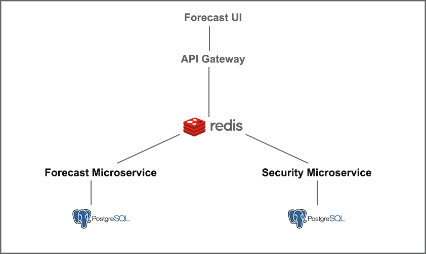

# Architecture

<br><br>

- **Forecast UI:** Displays the interfaces for the user to interact with the system.
- **API Gateway:** Orchestrate requests and hide the underlying backend from the user. 
- **Redis Queue:** Communications between the API Gateway and other components are event-based and they are stored in the Redis queue, that will be consumed by the component.
- **Security Microservice:** Implements the authentication and authorization mechanisms.
- **Forecast Microservice:** Predicts the sales of a specific product 


# Installation
Running the project:
```bash
docker-compose up
```
#